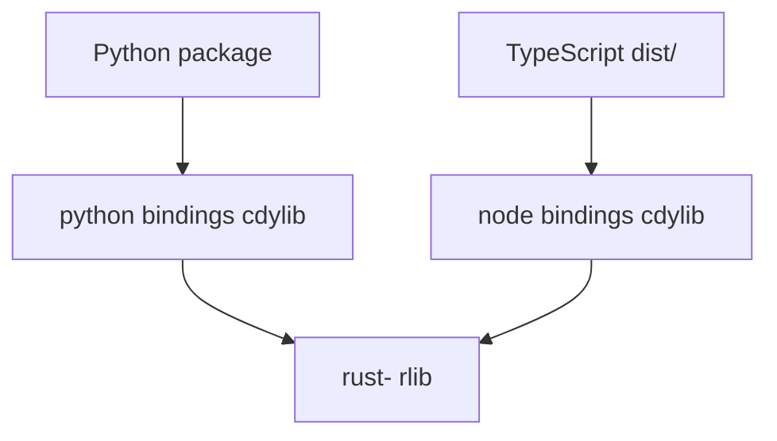

# Polyglot Scaffold Architecture

Reference layout for Rust-first polyglot monorepos generated by `polyglot-scaffold`.

## Principles

1. **Rust-first** — All business logic lives in `src/rust-<project>/`. Bindings are thin adapters.
2. **Two-layer bindings** — Each host language exposes a native module plus an idiomatic wrapper (`_core.py`, `src/index.ts`).
3. **Makefile orchestration** — One command surface (`make`) for humans and CI.
4. **Workspace exclusions** — Python bindings are excluded from default `cargo build --workspace` (use maturin instead).

## Directory layout

```
<project>/
├── Cargo.toml
├── Makefile
├── package.json
├── pnpm-workspace.yaml
├── src/
│   ├── rust-<project>/           # rlib core crate
│   ├── python-<project>/         # PyO3 cdylib + maturin package
│   └── node-<project>/           # napi-rs cdylib + TypeScript wrapper
└── .github/workflows/ci.yml
```

## Crate relationships



## Stub API

Start with `echo(bytes) -> bytes` in Rust and mirror it in Python and TypeScript so `make` passes immediately. Replace the stub in `src/rust-<project>/src/lib.rs` only.

## Placeholder tokens

Templates use literal `myplaceholder*` tokens in the style they should end up in (snake, kebab, PascalCase, camelCase). `scripts/scaffold.py` copies the template and replaces tokens — see `SKILL.md` for the full mapping.

## Toolchain versions

- Rust stable (pinned via `rust-toolchain.toml`)
- Python 3.10+ via uv + maturin
- Node 22+ via pnpm 9 + napi-rs
